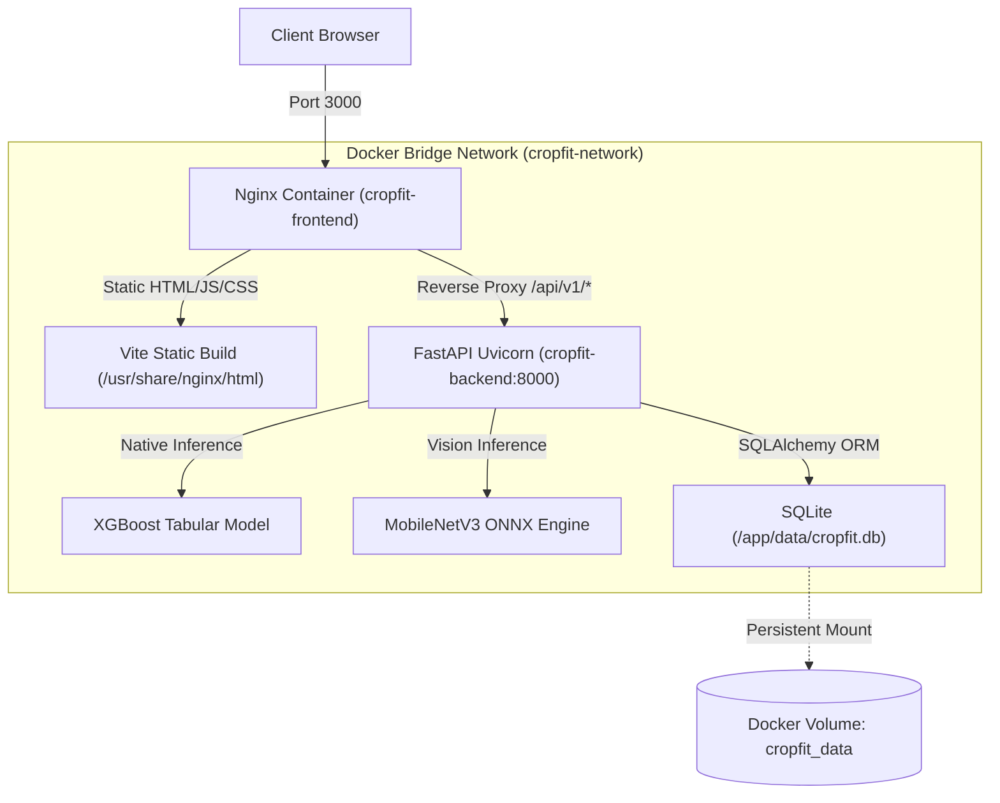

# Session 010 — Containerization & Orchestration

**Milestone**: 🏁 Containerized (S096)  
**Phases**: Phase 31 (Logging & Errors), Phase 32 (Docker), Phase 33 (Docker Compose)  
**Date**: October 2026  
**Status**: 🟢 Completed  

---

## 1. Overview & Architectural Goals

The goal of Session 10 (Milestone 10) is to transform the localized development environment of **Cropfit** into a portable, cloud-ready, containerized multi-service ecosystem. By encapsulating our FastAPI ML inference engine, SQLite database persistence, and React Vite frontend behind an Nginx reverse proxy, the system achieves reproducibility across any Linux, macOS, or Windows host without local dependency pollution.

---

## 2. Sub-Sessions Breakdown

### 2.1 Sub-Session 10.1 (Phase 31: S091–S092) — Production Logging & Error Handling
* **12-Factor Logging**: Configured structured stream logging to `sys.stdout` via [`backend/app/core/logging.py`](file:///C:/Users/TICKMARKS/OneDrive%20-%20tickmarks.net/Desktop/Cropfit/backend/app/core/logging.py). Containers treat logs as unbuffered event streams.
* **Log Pollution Prevention**: Added `EndpointFilter` to silence routine liveness polling on `/api/v1/health` while keeping audit trails crisp.
* **Global Error Envelope**: Implemented global FastAPI exception handling in [`backend/app/main.py`](file:///C:/Users/TICKMARKS/OneDrive%20-%20tickmarks.net/Desktop/Cropfit/backend/app/main.py) returning standardized JSON envelopes (`status_code=500`, `detail`, `error_type`).
* **Liveness & Readiness Probes**: Added `GET /api/v1/health` exposing database status, model residency flags (`crop_model_loaded`, `vision_engine_loaded`), and version info.

### 2.2 Sub-Session 10.2 (Phase 32: S093) — Backend Multi-Stage Dockerfile
* **Multi-Stage Build**:
  - **Stage 1 (`builder`)**: Uses `python:3.11-slim`, builds virtual environment in `/opt/venv`, and installs dependencies from `requirements.txt`.
  - **Stage 2 (`runner`)**: Lean Debian slim base with copied virtual environment, removing compiler toolchains and development artifacts.
* **Container Security (Principle of Least Privilege)**: Created non-root user `appuser` (UID 10001, GID 10001) rather than running as root.
* **Artifact Portability**: Models directory mounted at `/app/ml_experiments/models` with configurable `MODELS_DIR` environment variable.
* **Database Volume Target**: Default `DATABASE_URL=sqlite:////app/data/cropfit.db` targeted at `/app/data` volume.
* **Built-in Health Check**: Executes non-blocking Python `urllib.request` probe against `/api/v1/health`.

### 2.3 Sub-Session 10.3 (Phase 32: S094) — Frontend Multi-Stage Dockerfile & Nginx Reverse Proxy
* **Multi-Stage Build**:
  - **Stage 1 (`builder`)**: Uses `node:20-alpine`, runs `npm ci`, and executes `npm run build` (`tsc && vite build`) to generate tree-shaken static assets in `dist/`.
  - **Stage 2 (`runner`)**: Uses `nginx:1.27-alpine` to serve static assets with ultra-low memory footprint ($\approx 20\text{ MB}$).
* **Nginx Reverse Proxy & Hardening**:
  - `client_max_body_size 15M;` to support high-resolution leaf disease photo uploads.
  - SPA fallback routing: `try_files $uri $uri/ /index.html;`.
  - Gzip compression enabled for all JSON, CSS, and JS assets.
  - Fingerprinted asset caching (`Cache-Control: public, max-age=31536000, immutable`).
  - Reverse proxy `/api/` seamlessly to backend container `http://backend:8000/api/`, eliminating Cross-Origin Resource Sharing (CORS) complexity in production.

### 2.4 Sub-Session 10.4 (Phase 33: S095–S096) — Docker Compose Orchestration & Health Checks
* **Service Composition**: [`docker-compose.yml`](file:///C:/Users/TICKMARKS/OneDrive%20-%20tickmarks.net/Desktop/Cropfit/docker-compose.yml) orchestrates `backend` and `frontend`.
* **Persistent Volumes**: Named volume `cropfit_data` mounted to `/app/data` guarantees database records persist across container restarts and redeployments.
* **Isolated Networking**: Custom bridge network `cropfit-network` provides private DNS service discovery.
* **Deterministic Startup Order**: Frontend uses `depends_on: backend: condition: service_healthy` to guarantee backend ML models and database are ready before Nginx accepts traffic.

---

## 3. Architecture Diagram

---

## 4. Verification & Validation Metrics

| Check | Target | Achieved | Status |
|-------|--------|----------|--------|
| Backend Pytest Suite | All Pass | 22 / 22 Passed | 🟢 |
| Backend Statement Coverage | $\ge 80\%$ | **87%** | 🟢 |
| Health Check Endpoint | 200 OK | `/api/v1/health` Verified | 🟢 |
| Frontend Production Build | Zero Errors | `tsc && vite build` Succeeded | 🟢 |
| Frontend Contract Suite | All Pass | 2 / 2 Passed | 🟢 |
| Docker Configurations | Valid syntax | Dockerfiles, Compose, Nginx created | 🟢 |

---

## 5. Next Steps
* Proceed to **Milestone 11 (Session 11: 🏁 Deployed - S103)**:
  - Phase 34: CI/CD automation with GitHub Actions.
  - Phase 35: Public cloud deployment configuration.
  - Phase 36: Production smoke testing and SSL hardening.
